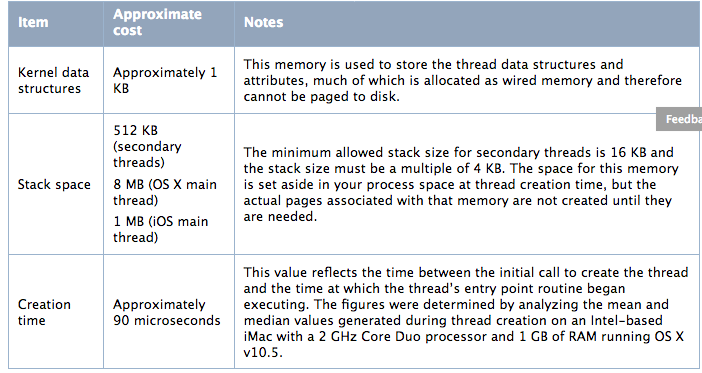

# Thread Management
> [原文地址](https://developer.apple.com/library/content/documentation/Cocoa/Conceptual/Multithreading/CreatingThreads/CreatingThreads.html#//apple_ref/doc/uid/10000057i-CH15-SW2)

# Thread Costs

# Create a Thread
### Using NSThread
There are two ways to create a thread using the [NSThread](https://developer.apple.com/documentation/foundation/nsthread) class:
* Use the [detachNewThreadSelector:toTarget:withObject:](https://developer.apple.com/documentation/foundation/nsthread/1415633-detachnewthreadselector) class method to spawn the new thread
* Create a new NSThread object With [initWithTarget:selector:object:](https://developer.apple.com/documentation/foundation/thread/1414773-init) method and call its [start](https://developer.apple.com/documentation/foundation/nsthread/1418166-start?language=objc) method. (Supported only in iOS and OS X v10.5 and later.)

# 2种方法的区别，一个类方向，调用方法的时间立刻启动线程，一个实例方法，调用只是创建，可以现在之后，调用[start](https://developer.apple.com/documentation/foundation/nsthread/1418166-start?language=objc) 方法启动线程

### Using POSIX Threads
OS X and iOS provide C-based support for creating threads using the POSIX thread API. This technology can actually be used in any type of application (including Cocoa and Cocoa Touch applications) and might be more convenient if you are writing your software for multiple platforms.For example, you might use POSIX threads if you already have code that uses them and you do not want to rewrite it
> 优点:1、C底层，跨平台；2、上面说you do not want to rewrite it，这句还待斟酌

### Using NSobject to Spawn a Thread
 [The performSelectorInBackground:withObject:](https://developer.apple.com/documentation/objectivec/nsobject/1412390-performselectorinbackground) method creates a new detached thread and uses the specified method as the entry point for the new thread
 
 ### Using POSIX Threads in a Cocoa Application
 You should still be aware of the interactions between Cocoa and threads and obey the guidelines in the following sections
 ##### Protecting the Cocoa Frameworks
For multithreaded applications, Cocoa frameworks use locks and other forms of internal synchronization to ensure they behave correctly. To prevent these locks from degrading performance in the single-threaded case, however, Cocoa does not create them until the application spawns its first new thread using the [NSThread](https://developer.apple.com/documentation/foundation/nsthread) class. If you spawn threads using only POSIX thread routines, Cocoa does not receive the notifications it needs to know that your application is now multithreaded. When that happens, operations involving the Cocoa frameworks may destabilize or crash your application
 To let Cocoa know that you intend to use multiple threads, all you have to do is spawn a single thread using the NSThread class and let that thread immediately exit. Your thread entry point need not do anything. Just the act of spawning a thread using NSThread is enough to ensure that the locks needed by the Cocoa frameworks are put in place.
 If you are not sure if Cocoa thinks your application is multithreaded or not, you can use the [isMultiThreaded](https://developer.apple.com/documentation/foundation/nsthread/1410702-ismultithreaded) method of NSThread to check
 > 上面大体意思:多线程应用会使用lock或者其他形式的内核同步确保行为正常，但是会损耗性能，所以程序应用默认是单线程，直到第一次使用[NSThread](https://developer.apple.com/documentation/foundation/nsthread)，而[POSIX]() 不会通知应用开启多线程。就是要你第一次使用前，使用一下[NSThread](https://developer.apple.com/documentation/foundation/nsthread)，确认程序正常，不会崩溃或者错误。
 
 ##### Mixing POSIX and Cocoa Locks
 > Cocoa locks和POSIX提供的同步手段，可以一起用，但是不能混用，同一类型的锁和解锁需要成双成对的使用。
 
 ### Configuring Thread Attributes
 1. Configuring the Stack Size of a Thread
 2. Configuring Thread-Local Storage
 3. Setting the Detached State of a Thread
 4. Setting the Thread Priority
 
 
### Configuring the Stack Size of a Thread
> The stack manages the stack frames and is also where any local variables for the thread are declared.
If you want to change the stack size of a given thread, you must do so before you create the thread. All of the threading technologies provide some way of setting the stack size, although setting the stack size using NSThread is available only in iOS and OS X v10.5 and later
大致意思: 1、必须在使用线程之前配置堆栈大小；2、只有iOS5.0之后支持[NSThread](https://developer.apple.com/documentation/foundation/nsthread) [setStackSize:](https://developer.apple.com/documentation/foundation/thread/1415190-stacksize) Method.
###### 手段: 
1. Cocoa:  [setStackSize: ](https://developer.apple.com/documentation/foundation/thread/1415190-stacksize)
2. POSIX:  [pthread_attr_setstacksize]()
3. Multiprocessing Services: Pass the appropriate stack size value to the MPCreateTask function when you create your thread.

### Configuring Thread-Local Storage
Each thread maintains a dictionary of key-value pairs that can be accessed from anywhere in the thread. You can use this dictionary to store information that you want to persist throughout the execution of your thread
> 我估计就是储存在内核数据结构的部分数据
###### 手段：
1. Cocoa: you use the [threadDictionary](https://developer.apple.com/documentation/foundation/thread/1411433-threaddictionary) method of an [NSThread](https://developer.apple.com/documentation/foundation/nsthread) object to retrieve an NSMutableDictionary object, to which you can add any keys required by your thread.
2. POSIX: pthread_setspecific and pthread_getspecific.
> 同POSIX锁，同一类型的方法，需要成双成对的使用，不能混用。

### Setting the Detached State of a Thread
Most high-level thread technologies create detached threads by default
> 关于，分离状态的线程和连接状态的线程区别，这里不做介绍。原文这里提到了,连接状态的线程的资源回收必须要等到有其他线程和他连接，连接的过程会堵塞进程，而分离状态的线程：线程完成立刻回收，进程结束立刻回收。By comparison, the system does not reclaim the resources for joinable threads until another thread explicitly joins with that thread, a process which may block the thread that performs the join. 
> At application exit time, detached threads can be terminated immediately but joinable threads cannot. Each joinable thread must be joined before the process is allowed to exit. Joinable threads may therefore be preferable in cases where the thread is doing critical work that should not be interrupted, such as saving data to disk. 可连接线程，适合做一些不应被中断关键工作，如数据保存磁盘。

###### 手段：
1. If you do want to create joinable threads, the only way to do so is using POSIX threads. POSIX creates threads as joinable by default

### Setting the Thread Priority
> Important: It is generally a good idea to leave the priorities of your threads at their default values. Increasing the priorities of some threads also increases the likelihood of starvation among lower-priority threads. If your application contains high-priority and low-priority threads that must interact with each other, the starvation of lower-priority threads may block other threads and create performance bottlenecks.
> 就是说不建议设置优先级咯。
###### 手段：
1. NSThread: [setThreadPriority:](https://developer.apple.com/documentation/foundation/thread/1407523-setthreadpriority)
2. POSIX: [pthread_setschedparam]()

 
 
 

